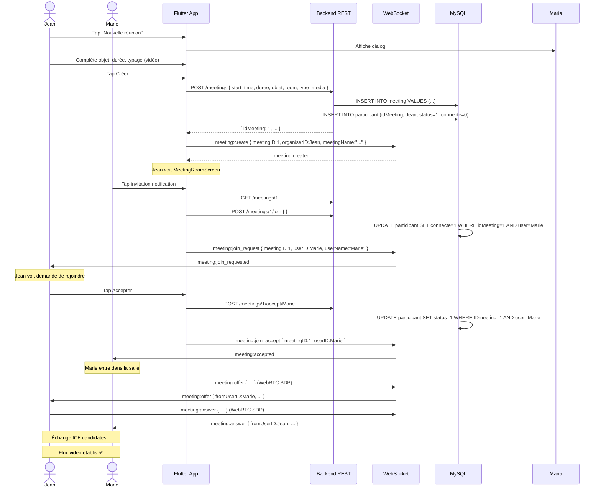

# 📊 Analyse État des Meetings - Talky

**Date:** 23 avril 2026  
**Application:** Flutter Talky (Enterprise Messaging)

---

## 🎯 Vue d'ensemble

Talky dispose d'un système de **réunions vidéo/audio de groupe** complet avec :
- ✅ Architecture REST + WebSocket
- ✅ Signalisation WebRTC mesh (multiple utilisateurs)
- ✅ Gestion des participants avec système d'invitation
- ✅ Chat en temps réel dans les réunions
- ⚠️ API Flutter partiellement implémentée

---

## 📱 Architecture Flutter

### Structure des Fichiers

```
lib/features/meetings/
├── data/
│   ├── meeting_service.dart      (WebRTC + EventStreams)
│   └── meeting_providers.dart    (Riverpod + REST)
├── domain/
│   └── meeting_model.dart        (Models Dart)
└── presentation/
    ├── meetings_screen.dart               (Liste réunions)
    ├── meeting_room_screen.dart           (Écran actif)
    ├── meeting_invitations_screen.dart    (Invitations)
    └── select_meeting_participants_screen.dart
```

### 1️⃣ **MeetingModel** (Domain)

```dart
class MeetingParticipantModel {
  final int idMeeting;
  final int alanyaID;
  final String nom;
  final String pseudo;
  final String? avatarUrl;
  final bool isOnline;
  final int status;        // 0=invité, 1=accepté, 2=refusé
  final bool connecte;
  final int duree;         // secondes
}

class MeetingModel {
  final int idMeeting;
  final int idOrganiser;
  final String organiserNom;
  final String organiserPseudo;
  final String? organiserAvatar;
  final DateTime startTime;
  final int duree;         // minutes
  final String objet;      // Objet/Titre
  final String room;       // Identifiant salle
  final bool isEnd;        // Terminée?
  final int typeMedia;     // 0=audio, 1=vidéo
  final List<MeetingParticipantModel> participants;
  
  // Getters utiles
  bool get isVideo => typeMedia == 1;
  bool get isActive => !isEnd && startTime.isBefore(
    DateTime.now().add(Duration(minutes: 30))
  );
}
```

### 2️⃣ **MeetingService** (Data - WebRTC)

**État partagé avec CallService** (même socket WebSocket partagé)

#### Streams publics exposés :
| Stream | Type | Usage |
|--------|------|-------|
| `events` | `Stream<MeetingEvent>` | Jointe, Démarrée, Terminée, Erreur, Connectée |
| `localStream` | `Stream<MediaStream?>` | Flux vidéo/audio local |
| `remoteStreams` | `Stream<Map<String, MediaStream>>` | Flux des participants distants |
| `participantEvents` | `Stream<MeetingParticipantEvent>` | Quelqu'un rejoint/quitte |
| `chatMessages` | `Stream<MeetingChatMessage>` | Messages chat réunion |

#### ICE Configuration :
- **STUN servers:** Google, Relay Metered
- **TURN servers:** global.relay.metered.ca (auth: 4ccd30e6211751522c93c044 / iB+/hPI3lLayZAKn)

#### Socket Events (WebSocket)

**Flutter → Serveur :**
```
meeting:create        { meetingID, organiserID, meetingName }
meeting:join_request  { meetingID, userID, userName }
meeting:join_accept   { meetingID, userID }
meeting:join_decline  { meetingID, userID }
meeting:start         { meetingID }
meeting:end           { meetingID }
meeting:chat          { meetingID, userID, message }
meeting:leave         { meetingID }
meeting:offer         { meetingID, toUserID, offer:{sdp,type} }
meeting:answer        { meetingID, toUserID, answer:{sdp,type} }
meeting:ice_candidate { meetingID, toUserID, candidate:{...} }
```

**Serveur → Flutter :**
```
meeting:started       { meetingID }
meeting:ended         { meetingID }
meeting:accepted      { meetingID }
meeting:declined      { meetingID }
meeting:user_joined   { meetingID, userID }
meeting:user_left     { meetingID, userID }
meeting:offer         { fromUserID, offer:{sdp,type}, meetingID }
meeting:answer        { fromUserID, answer:{sdp,type}, meetingID }
meeting:ice_candidate { fromUserID, candidate:{...}, meetingID }
meeting:message       { meetingID, userID, message, sendAt }
```

### 3️⃣ **Meeting Providers** (Riverpod)

```dart
// Liste des réunions (cached via REST)
final meetingsListProvider = FutureProvider.autoDispose<List<MeetingModel>>

// Détail d'une réunion spécifique
final meetingDetailProvider = FutureProvider.family.autoDispose<MeetingModel, int>

// Service singleton
final meetingServiceProvider = Provider<MeetingService>

// État de la room active
final meetingRoomProvider = StateNotifierProvider<MeetingRoomNotifier, MeetingRoomState>
```

#### MeetingRoomState :
```dart
class MeetingRoomState {
  final bool isInRoom;              // Connecté à la salle?
  final bool isStarted;             // La réunion a commencé?
  final String? meetingID;
  final bool isMuted;               // Micro coupé?
  final bool isCameraOff;           // Caméra éteinte?
  final List<String> participantIDs; // UIDs des participants actifs
  final List<MeetingChatMessage> chatMessages;
  final String? error;
}
```

### 4️⃣ **UI Screens**

#### MeetingsScreen
- ✅ Liste toutes les réunions de l'utilisateur (organisées + participantes)
- ✅ Bouton FAB "Nouvelle réunion" (ouvre dialog de création)
- ✅ Refresh manuel
- ✅ Message d'absence si liste vide

#### MeetingRoomScreen
- ✅ Affiche grille vidéo (local + participants distants)
- ✅ Minuteur de durée (`HH:MM:SS`)
- ✅ Contrôles: mute, caméra, partage écran, chat
- ✅ Affichage d'erreurs d'initialisation
- ✅ Support audio-only (audio.isVideo)

#### MeetingInvitationsScreen
- État de la liste des invitations à réunions
- Accepter/refuser

---

## 🗄️ Base de Données (MySQL)

### Table `meeting`
```sql
CREATE TABLE meeting (
  idMeeting   INT          PRIMARY KEY AUTO_INCREMENT,
  idOrganiser INT          NOT NULL (FK → users),
  start_time  DATETIME     NOT NULL,
  duree       INT          DEFAULT 0      -- minutes
  objet       VARCHAR(255) DEFAULT 'NON DEFINI',
  room        VARCHAR(100) NOT NULL,      -- identifiant salle
  isEnd       TINYINT      DEFAULT 0,     -- 0=active, 1=terminée
  type_media  TINYINT      DEFAULT 0,     -- 0=audio, 1=vidéo
  INDEX (idOrganiser, start_time DESC)
);
```

### Table `participant`
```sql
CREATE TABLE participant (
  ID            INT PRIMARY KEY AUTO_INCREMENT,
  idMeeting     INT NOT NULL (FK → meeting, CASCADE),
  IDparticipant INT NOT NULL (FK → users),
  status        TINYINT DEFAULT 0,  -- 0=invité, 1=accepté, 2=refusé
  start_time    DATETIME DEFAULT NOW(),
  connecte      TINYINT,            -- 0/1 (est connecté?)
  duree         INT DEFAULT 0,      -- secondes
  UNIQUE KEY (idMeeting, IDparticipant)
);
```

---

## 🔌 Backend API

### Base URL
```
https://talky-signaling.onrender.com/api/meetings
```

### Endpoints REST

| Méthode | Endpoint | Contrôleur | Description |
|---------|----------|-----------|-------------|
| `GET` | `/meetings` | `getMeetings()` | Liste (organiser + participant) |
| `POST` | `/meetings` | `createMeeting()` | Créer réunion |
| `GET` | `/meetings/:id` | `getMeetingById()` | Détails + participants |
| `PUT` | `/meetings/:id` | `updateMeeting()` | Modifier (organisateur) |
| `DELETE` | `/meetings/:id` | `deleteMeeting()` | Annuler (organisateur) |
| `POST` | `/meetings/:id/join` | `joinMeeting()` | Rejoindre (demande) |
| `POST` | `/meetings/:id/invite` | `inviteParticipants()` | Inviter utilisateurs |
| `POST` | `/meetings/:id/accept/:userId` | `acceptJoinRequest()` | Accepter participant |
| `POST` | `/meetings/:id/decline/:userId` | `declineJoinRequest()` | Refuser participant |

### Requête POST /meetings (création)
```json
{
  "start_time": "2026-04-23T14:30:00Z",
  "duree": 60,
  "objet": "Réunion équipe",
  "room": "meeting_123456",
  "type_media": 1    // 0=audio, 1=vidéo
}
```

### Réponse GET /meetings/:id
```json
{
  "idMeeting": 1,
  "idOrganiser": 5,
  "organiser_nom": "Jean Dupont",
  "organiser_pseudo": "jean",
  "organiser_avatar": "https://...",
  "start_time": "2026-04-23T14:30:00Z",
  "duree": 60,
  "objet": "Réunion équipe",
  "room": "meeting_123456",
  "isEnd": 0,
  "type_media": 1,
  "participants": [
    {
      "IDparticipant": 5,
      "nom": "Jean Dupont",
      "pseudo": "jean",
      "avatar_url": "https://...",
      "is_online": 1,
      "status": 1,      // 0=invité, 1=accepté
      "connecte": 1,
      "duree": 1234
    }
  ]
}
```

---

## ⚠️ PROBLÈMES IDENTIFIÉS

### 🔴 **CRITIQUE - API Flutter incomplète**

**Fichier:** [lib/core/services/api_service.dart](lib/core/services/api_service.dart)

**Manquent complètement :**
```dart
// À AJOUTER:
Future<List<MeetingModel>> getMeetings() async { ... }
Future<MeetingModel> createMeeting(MeetingModel meeting) async { ... }
Future<MeetingModel> getMeetingById(int id) async { ... }
Future<MeetingModel> updateMeeting(int id, Map<String, dynamic> data) async { ... }
Future<void> deleteMeeting(int id) async { ... }
Future<void> joinMeeting(int id) async { ... }
Future<void> inviteParticipants(int id, List<int> userIds) async { ... }
Future<void> acceptJoinRequest(int id, int userId) async { ... }
Future<void> declineJoinRequest(int id, int userId) async { ... }
```

**Impact:** Les méthodes de création/modification de réunions ne peuvent pas être appelées proprement depuis le Flutter. La couche métier doit appeler directement les URLs via HTTP, ce qui diminue la maintenabilité.

### 🟡 **MAJOR - Socket.io handlers incohérents**

**Fichiers:**
- [Serveur/src/socket/handlers/meetings.js](Serveur/src/socket/handlers/meetings.js) (150 lignes)
- [Serveur/src/socket/handlers/meetings_sockets.js](Serveur/src/socket/handlers/meetings_sockets.js) (duplicata?)

**Problème:** Deux fichiers avec le même contenu/objectif? Clarifier lequel est actif dans [server.js](Serveur/server.js).

### 🟡 **MAJOR - État Riverpod du chat meeting manquant**

Les `chatMessages` du `MeetingRoomState` sont écoutés mais pas exposés via Provider pour le widget UI.

**Solution suggérée:**
```dart
final meetingChatMessagesProvider = Provider<List<MeetingChatMessage>>((ref) {
  final service = ref.watch(meetingServiceProvider);
  return service.chatMessages // expose l'état
});
```

### 🟠 **MODERATE - Gestion des erreurs WebRTC minimaliste**

- Pas de retry automatique en cas de perte conexión
- Pas de fallback audio → audio-only si vidéo échoue
- Peu de feedback utilisateur sur les états de connexion

### 🟠 **MODERATE - Permissions Android/iOS non gérées**

Le `meeting_service.dart` ne vérifie pas les permissions avant d'accéder à la caméra/micro.

**Dépendance existante:** `permission_handler: ^11.3.1` → à utiliser.

### 🟡 **MINOR - Persistance de chat réunion**

Les messages envoyés dans la réunion(stream chat) ne sont pas persistés en DB. Points, perte après déconnexion.

---

## 📋 Checklist Implémentation

- [x] Backend REST endpoints
- [x] Socket.io handlers (salle + WebRTC signaling)
- [x] MeetingModel & MeetingParticipantModel
- [x] MeetingService (WebRTC sur flutter_webrtc)
- [x] MeetingsScreen & MeetingRoomScreen UI
- [ ] **ApiService.meetingMethods()** ← À IMPLÉMENTER
- [ ] Chat persistence en DB
- [ ] Permissions vérifiées avant accès media
- [ ] Retry WebRTC + fallback audio
- [ ] Meeting history (durée réelle, recordings si applicable)
- [ ] Gestion waiting room (quitter après refus)

---

## 🔄 Flux Complet: Créer & Rejoindre une Réunion

### Scénario: Jean (organizer) crée une réunion, Marie la rejoint



---

## 📊 Statistiques du Code

| Métrique | Valeur |
|----------|--------|
| **Fichiers meetings Flutter** | 6 (domain, data, presentation) |
| **Fichiers backend** | 4 (controller, routes, socket, scheduler) |
| **Modèles** | 2 (Meeting, MeetingParticipant) |
| **Providers Riverpod** | 4 (service, list, detail, room) |
| **Socket events** | 13 (room + WebRTC signaling) |
| **REST endpoints** | 9 |
| **Tests** | ❌ Aucun |

---

## 🎯 Points Forts

✨ **Architecture modulaire** — Feature-first avec clear separation concerns  
✨ **WebRTC mesh** — Support multiple participants (pas just peer-to-peer)  
✨ **Real-time** — Socket.io pour événements immédiats  
✨ **Models typisés** — Dart models fortement typés  
✨ **Error handling** — Try-catch dans preséentation  
✨ **State management** — Riverpod bien structuré

---

## 🎯 Axes d'Amélioration

1. **Compléter ApiService.dart** avec les méthodes meetings manquantes
2. **Ajouter logging/debugging** pour WebRTC (onIceCandidate, onAddStream)
3. **Tester** les scénarios edge: déconnexion réseau, timeout, etc.
4. **Persistence** des messages de chat réunion
5. **Permissions** vérifiées (déjà `permission_handler` en dépendance)
6. **Recording** optionnel (WebRTC MediaRecorder API)
7. **Screen sharing** (WebRTC getDisplayMedia)

---

## 📚 Documentation Complémentaire

- [Backend Spec](BACKEND.md) - Endpoints API
- [Database Schema](talky_database.sql) - Structure MySQL
- [Rapport Complet](rapport/rapport_talky.tex) - Architecture globale
- [Call Service](../calls/data/call_service.dart) - WebRTC 1:1 (semblable)

---

**Généré:** 2026-04-23  
**Statut:** ✅ Réunions partiellement implémentées (besoin finition API Flutter)
