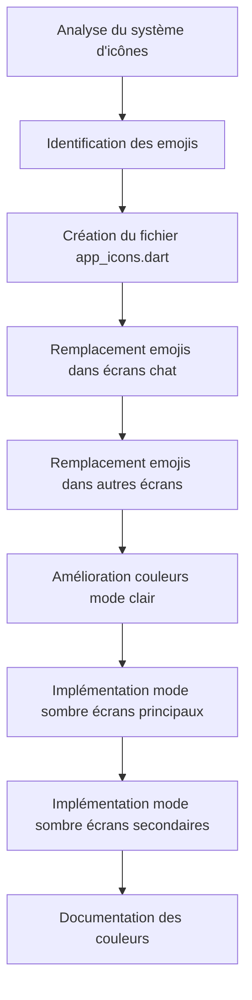

# Plan d'Amélioration du Design de Talky

## 1. Analyse du Système d'Icônes Actuel

### Style utilisé dans les paramètres (référence)
Les paramètres utilisent des **Material Icons Outlined** avec un conteneur arrondi:
```dart
Container(
  width: 40,
  height: 40,
  decoration: BoxDecoration(
    color: colors.primary.withOpacity(0.1),
    borderRadius: BorderRadius.circular(10),
  ),
  child: Icon(icon, color: colors.primary, size: 22),
)
```

### Icônes actuellement utilisées dans les paramètres
- `Icons.person_outline_rounded` - Profil
- `Icons.notifications_outlined` - Notifications
- `Icons.music_note_outlined` - Son
- `Icons.call_outlined` - Appels
- `Icons.vibration_outlined` - Vibreur
- `Icons.palette_outlined` - Thème
- `Icons.language_outlined` - Langue
- `Icons.visibility_outlined` - Confidentialité
- `Icons.photo_library_outlined` - Photo
- `Icons.done_all_outlined` - Confirmation
- `Icons.videocam_outlined` - Vidéo
- `Icons.security_outlined` - Sécurité
- `Icons.mail_outline_rounded` - Contact
- `Icons.info_outline_rounded` - Version
- `Icons.description_outlined` - Conditions

---

## 2. Emojis à Remplacer par des Icônes Professionnelles

### conversations_screen.dart
| Emoji | Remplacement suggéré | Contexte |
|-------|---------------------|----------|
| 📷 | `Icons.image_outlined` | Photo |
| 🎥 | `Icons.videocam_outlined` | Vidéo |
| 🎤 | `Icons.mic_outlined` | Vocal/Audio |
| 📎 | `Icons.attach_file_outlined` | Fichier |
| 🚫 | `Icons.block_outlined` | Message supprimé |
| 👥 | `Icons.group_outlined` | Groupe |

### chat_screen.dart
| Emoji | Remplacement suggéré | Contexte |
|-------|---------------------|----------|
| 🚫 | `Icons.block_outlined` | Message supprimé |
| 👋 | `Icons.waving_hand_outlined` | Salutation vide |
| (Emoji picker) | Garder les emojis mais améliorer le design | Clavier d'émojis |

### groups_screen.dart
| Emoji | Remplacement suggéré | Contexte |
|-------|---------------------|----------|
| 👥 | `Icons.group_outlined` | Groupe |

### new_chat_screen.dart
| Emoji | Remplacement suggéré | Contexte |
|-------|---------------------|----------|
| 👥 | `Icons.group_outlined` | Groupe |

### phone_screen.dart
| Emoji | Remplacement suggéré | Contexte |
|-------|---------------------|----------|
| 📱 | `Icons.smartphone_outlined` | Téléphone |

### onboarding_screen.dart
| Emoji | Remplacement suggéré | Contexte |
|-------|---------------------|----------|
| 🔒 | `Icons.lock_outlined` | Confidentialité |

### login_screen.dart
| Emoji | Remplacement suggéré | Contexte |
|-------|---------------------|----------|
| 👋 | `Icons.waving_hand_outlined` | Salutation |

### user_model.dart & profile_settings_screen.dart & profile_setup_screen.dart
| Emoji | Remplacement suggéré | Contexte |
|-------|---------------------|----------|
| 👋 Disponible sur Talky | "Disponible sur Talky" (texte) | Statut |
| 👤 | `Icons.person_outlined` | Avatar par défaut |

### voice_recorder_widget.dart
| Emoji | Remplacement suggéré | Contexte |
|-------|---------------------|----------|
| 🎤 | `Icons.mic_outlined` | Micro |

### calls_screen.dart & incoming_call_screen.dart
| Emoji | Remplacement suggéré | Contexte |
|-------|---------------------|----------|
| 📹 | `Icons.videocam_outlined` | Appel vidéo |
| 🎙️ | `Icons.mic_outlined` | Appel audio |

---

## 3. Palette de Couleurs - Spécifications Détaillées

### Mode Sombre (Déjà implémenté - Conservation)
```dart
// Backgrounds
background:     Color(0xFF0A0A0F)  // Noir profond
surface:        Color(0xFF12121A)
surfaceVariant: Color(0xFF1C1C28)
surfaceHigh:    Color(0xFF252535)

// Text
textPrimary:    Color(0xFFF0EEFF)
textSecondary:  Color(0xFF9B96B8)
textHint:       Color(0xFF5A5570)

// Messages
bubbleSent:     Color(0xFF7C5CFC)      // Violet primaire
bubbleReceived: Color(0xFF1C1C28)
bubbleSentText: Color(0xFFFFFFFF)
bubbleReceivedText: Color(0xFFF0EEFF)

// Primary
primary:        Color(0xFF7C5CFC)  // Violet Talky
accent:         Color(0xFF4FC3F7)   // Bleu ciel

// Status
success:        Color(0xFF4CAF82)
error:          Color(0xFFFF5C7A)
online:         Color(0xFF4CAF82)

// Borders & Dividers
divider:        Color(0xFF1C1C28)
border:         Color(0xFF2A2A3C)
```

### Mode Clair (À améliorer pour plus d'harmonie)
```dart
// Backgrounds - Version améliorée
background:     Color(0xFFF8F9FC)    // Gris très clair bleuté
surface:        Color(0xFFFFFFFF)    // Blanc pur
surfaceVariant: Color(0xFFF0F2F5)    // Gris clair
surfaceHigh:    Color(0xFFE8EAED)    // Gris moyen

// Text - Meilleure lisibilité
textPrimary:    Color(0xFF1A1A2E)    // Noir bleuté
textSecondary:  Color(0xFF5A5A7A)    // Gris foncé
textHint:       Color(0xFF9E9EA8)   // Gris moyen

// Messages
bubbleSent:     Color(0xFF7C5CFC)    // Violet primaire
bubbleReceived: Color(0xFFF0F2F5)    // Gris clair
bubbleSentText: Color(0xFFFFFFFF)
bubbleReceivedText: Color(0xFF1A1A2E)

// Primary - Conservation
primary:        Color(0xFF7C5CFC)
accent:         Color(0xFF4FC3F7)

// Status
success:        Color(0xFF2E7D32)    // Vert foncé
error:          Color(0xFFD32F2F)    // Rouge foncé

// Borders & Dividers
divider:        Color(0xFFE0E2E5)
border:         Color(0xFFD0D2D5)
```

---

## 4. Écrans à Adapter au Mode Sombre

### Écrans principaux (3 écrans principaux)
1. **chat_screen.dart** - Écran de chat
2. **new_chat_screen.dart** - Nouvelle discussion
3. **groups_screen.dart** - Groupes

### Écrans secondaires
1. **create_group_screen.dart** - Création de groupe
2. **chat_details_screen.dart** - Détails du chat
3. **profile_setup_screen.dart** - Configuration du profil
4. **login_screen.dart** - Connexion
5. **register_screen.dart** - Inscription
6. **phone_screen.dart** - Écran téléphone
7. **otp_screen.dart** - Code OTP
8. **calls_screen.dart** - Liste des appels
9. **call_screen.dart** - Appel en cours
10. **incoming_call_screen.dart** - Appel entrant
11. **status_screen.dart** - Statut
12. **add_status_screen.dart** - Ajouter statut
13. **status_viewer_screen.dart** - Visionneuse de statut
14. **share_contact_screen.dart** -Partager contact
15. **media_picker_sheet.dart** - Sélecteur de médias
16. **voice_recorder_widget.dart** - Enregistreur vocal

### Paramètres (Écrans déjà en mode clair)
- **settings_screen.dart** ✓
- **appearance_settings_screen.dart** ✓
- **profile_settings_screen.dart** ✓

---

## 5. Structure des Fichiers à Créer/Modifier

### Nouveau fichier: lib/core/constants/app_icons.dart
```dart
// Constantes d'icônes professionnelles
class AppIcons {
  AppIcons._();

  // Message types
  static const IconData image = Icons.image_outlined;
  static const IconData video = Icons.videocam_outlined;
  static const IconData audio = Icons.mic_outlined;
  static const IconData file = Icons.attach_file_outlined;
  static const IconData deleted = Icons.block_outlined;

  // Social
  static const IconData group = Icons.group_outlined;
  static const IconData person = Icons.person_outlined;
  static const IconData waving = Icons.waving_hand_outlined;

  // Communication
  static const IconData call = Icons.call_outlined;
  static const IconData videoCall = Icons.videocam_outlined;
  static const IconData mic = Icons.mic_outlined;
  static const IconData smartphone = Icons.smartphone_outlined;

  // Security
  static const IconData lock = Icons.lock_outlined;

  // ... etc
}
```

### Fichiers à modifier:
1. `lib/core/constants/app_colors.dart` - Améliorer les couleurs claires
2. `lib/features/chat/presentation/conversations_screen.dart` - Remplacer emojis
3. `lib/features/chat/presentation/chat_screen.dart` - Remplacer emojis
4. `lib/features/chat/data/chat_service.dart` - Remplacer emojis
5. `lib/features/groups/presentation/groups_screen.dart` - Remplacer emojis
6. `lib/features/chat/presentation/new_chat_screen.dart` - Remplacer emojis
7. `lib/features/auth/presentation/phone_screen.dart` - Remplacer emojis
8. `lib/features/onboarding/presentation/onboarding_screen.dart` - Remplacer emojis
9. `lib/features/auth/presentation/login_screen.dart` - Remplacer emojis
10. `lib/features/auth/domain/user_model.dart` - Supprimer emoji du statut
11. `lib/features/settings/presentation/profile_settings_screen.dart` - Supprimer emoji
12. `lib/features/profile/presentation/profile_setup_screen.dart` - Remplacer emojis
13. `lib/features/chat/presentation/widgets/voice_recorder_widget.dart` - Remplacer emoji
14. `lib/features/calls/presentation/calls_screen.dart` - Remplacer emojis
15. `lib/features/calls/presentation/incoming_call_screen.dart` - Remplacer emojis

---

## 6. Diagramme de Flux des Tâches



---

## 7. Recommandations UX pour les Modes Clair et Sombre

### Lisibilité du texte
- **Mode sombre**: Utiliser un contraste ratio d'au moins 7:1 pour le texte principal
- **Mode clair**: Utiliser un contraste ratio d'au moins 4.5:1

### Distinction messages envoyés/reçus
- **Mode sombre**:
  - Envoyés: Violet (#7C5CFC) avec texte blanc
  - Reçus: Gris foncé (#1C1C28) avec texte clair
- **Mode clair**:
  - Envoyés: Violet (#7C5CFC) avec texte blanc
  - Reçus: Gris clair (#F0F2F5) avec texte sombre

### Transition fluide
- Utiliser `AnimatedTheme` ou `ThemeSwitcher`
- Durée de transition recommandée: 300ms
- Utiliser les mêmes couleurs de base avec des ajustements de luminosité

---

## 8. Checklist de Validation

- [ ] Toutes les icônes Material Icons Outlined utilisées
- [ ] Cohérence visuelle avec les paramètres
- [ ] Contraste optimal sur les deux thèmes
- [ ] Tous les écrans utilisent les couleurs dynamiques
- [ ]过渡动画平滑
- [ ] Documentation complète des couleurs